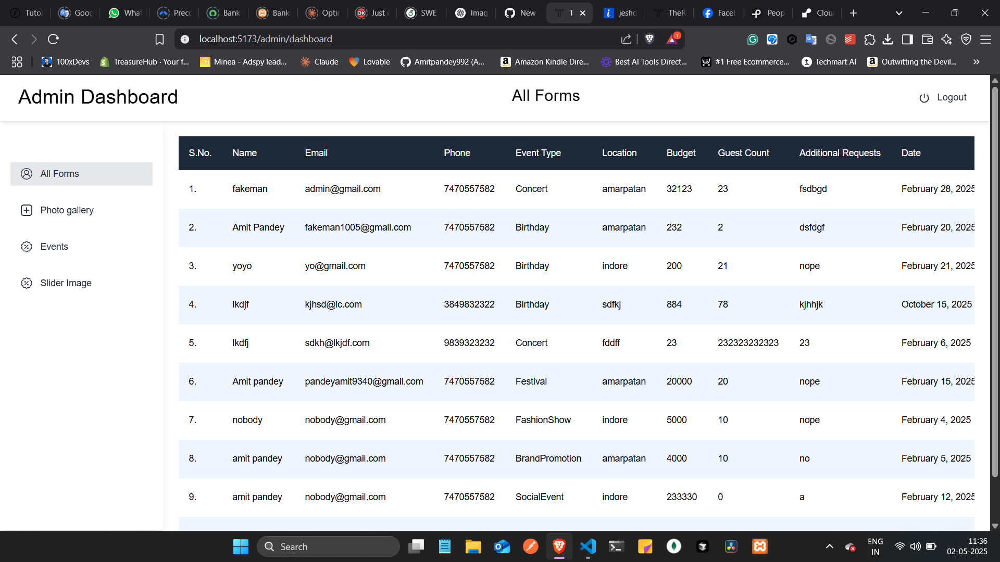
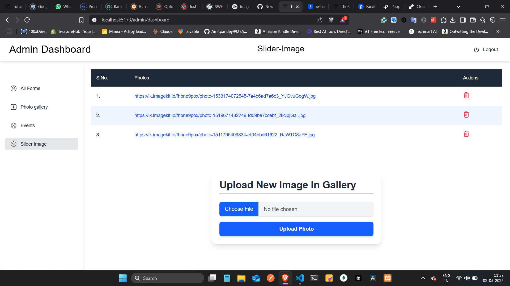
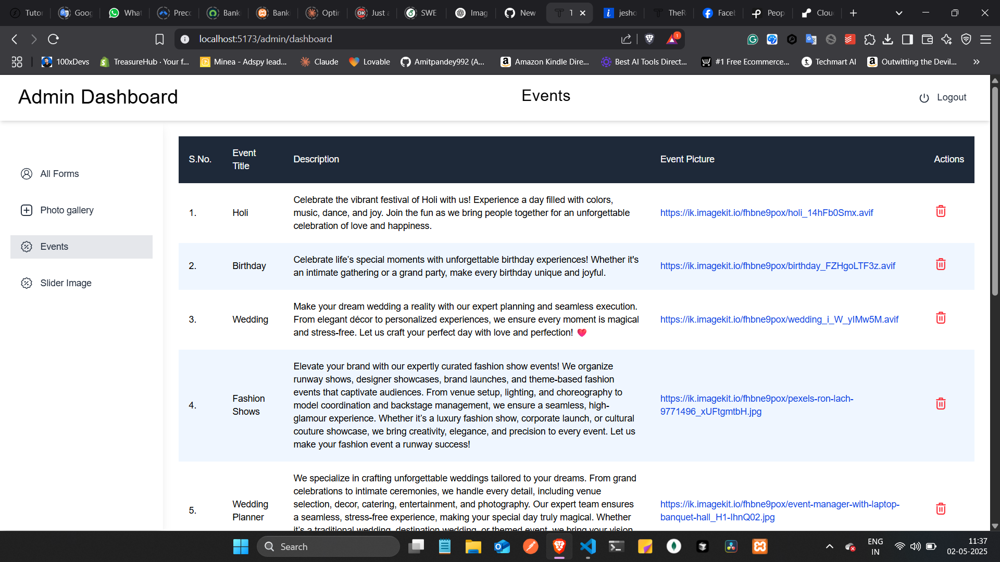

# Event Management Web Application

A full-stack **Event Management Web App** built using the **MERN stack** (MongoDB, Express.js, React, Node.js) with a responsive Admin Dashboard. This app allows admins to manage events and images dynamically, and users can view details and submit inquiries through a form.

---

## 🔥 Features

### 👤 Admin Panel
- Secure **admin login** with authentication
- **Add/Edit/Delete** event details
- Upload and manage **slider images** dynamically
- View and manage **user-submitted forms**

### 🎉 User Interface
- Dynamic event listing (fetched from database)
- Dynamic image slider on the homepage
- Contact or registration form for users

---

## 🛠️ Tech Stack

| Technology | Purpose                  |
|------------|--------------------------|
| MongoDB    | Database                 |
| Express.js | Backend framework        |
| React      | Frontend framework       |
| Node.js    | Server environment       |
| Mongoose   | MongoDB ORM              |
| Multer / Cloudinary / ImageKit | Image upload (choose one) |

---

## 📁 Project Structure

client/ # React frontend
└── src/
└── components/
└── pages/
└── App.js
server/ # Express backend
└── controllers/
└── models/
└── routes/
└── utils/
└── server.js


## 🚀 Getting Started

### 1. Clone the Repository

```bash
git clone https://github.com/yourusername/event-management-app.git
cd event-management-app
```
2. Install Dependencies
Install backend dependencies:

```bash
cd server
npm install
```
Install frontend dependencies:

```bash
cd ../client
npm install
```
3. Setup Environment Variables
Create .env files in both server and client folders with the necessary values like:

env
# server/.env
MONGO_URI=your_mongodb_connection_string
PORT=your_port_number
JWT_SECRET=your_jwt_secret
IMAGEKIT_PUBLIC_KEY=your_key
IMAGEKIT_PRIVATE_KEY=your_key
IMAGEKIT_URL_ENDPOINT=https://ik.imagekit.io/your_id
4. Run the App
Start the backend server:

```bash
cd server
npm start
```
Start the frontend:

```bash
cd ../client
npm start
```
🧠 Future Improvements
Admin user roles and permissions

Email notifications on form submissions

Payment gateway for paid events

SEO optimization

📷 Screenshots




🤝 Contributing
Pull requests are welcome! For major changes, please open an issue first.

📄 License
This project is licensed under the MIT License.

📬 Contact
Built with ❤️ by Amit Pandey

yaml


---

Would you like this as a downloadable file or want to include deployment instructions too (e.g., for  too (e.g., for Vercel, Render, or Hostinger)?
